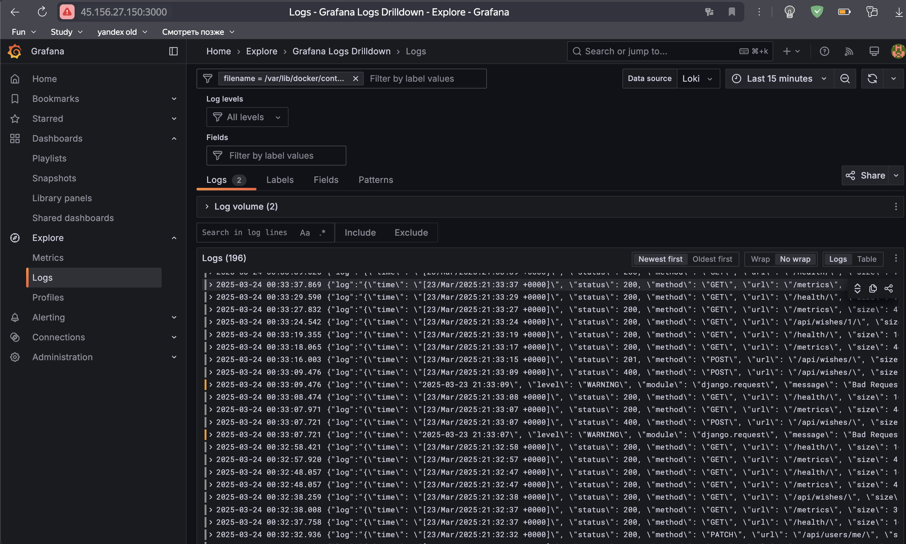
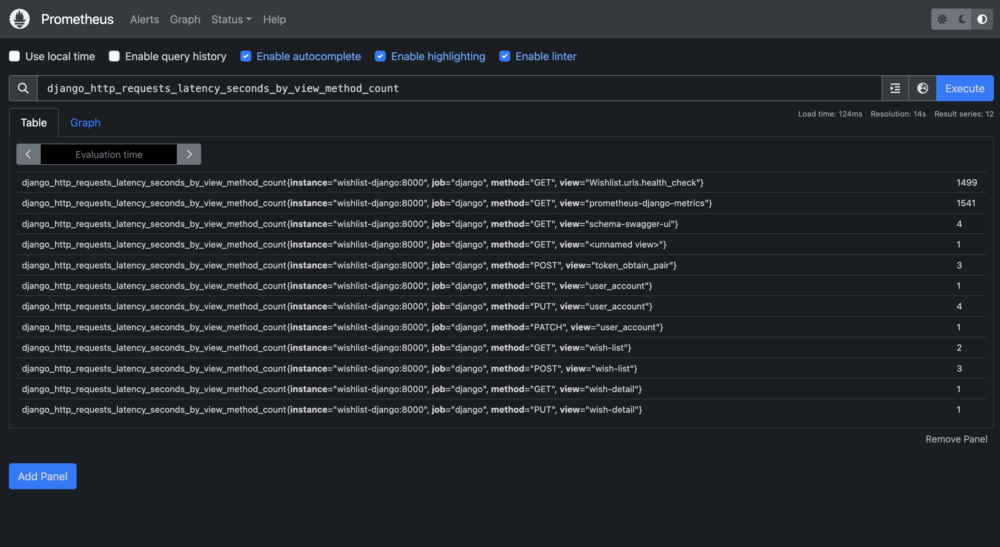
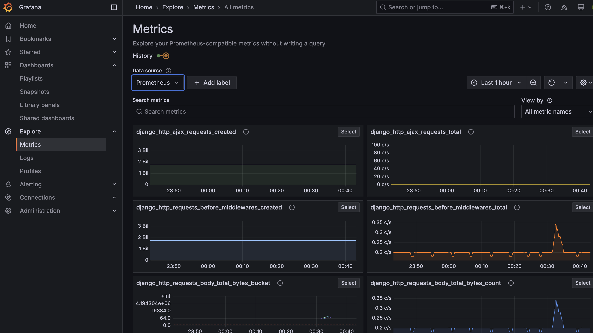
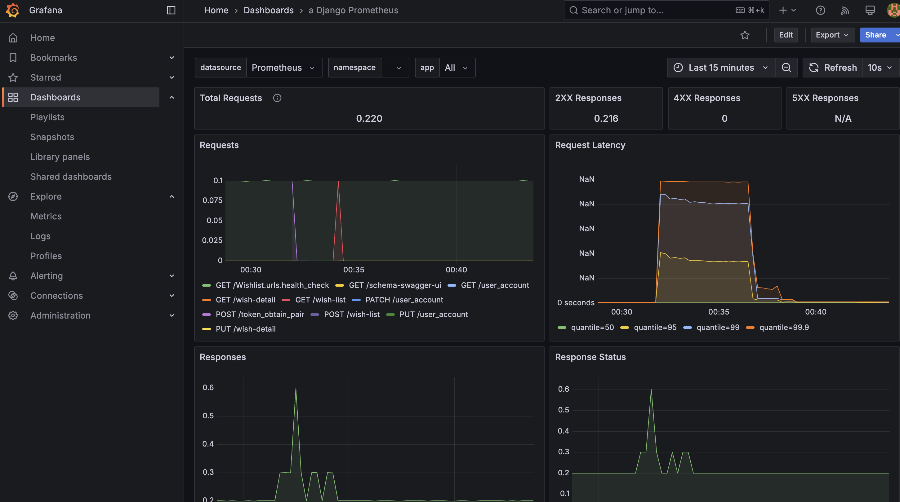
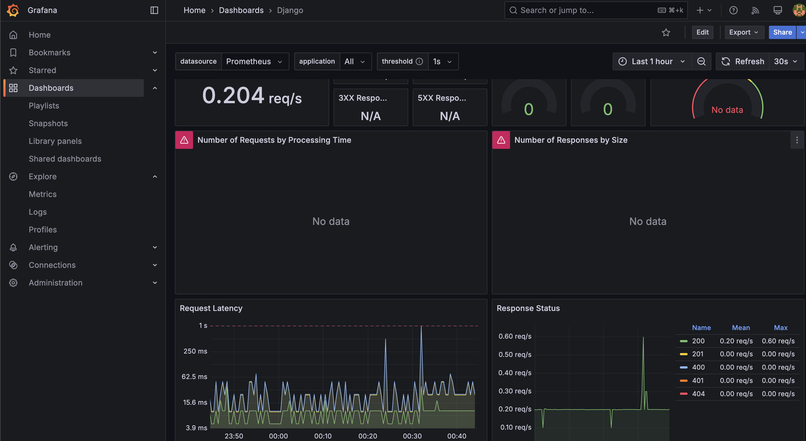

# НИС Промышленная инженерия программного обеспечения

# О приложении

Это проект реализованный на языке `Python` с помощью фреймворка `Django`. 

Для сборки используем `Docker` и `Docker Compose`.

Реализована регистрация, аутентификация с помощью JWT, работа с желаниями (CRUD) бизнес методы, логирование, сбор метрик и развёртывание в Docker. 

Есть два Github Action - доставка на виртуальную машину по адресу 45.156.27.150 [docker_compose_prod_flow.yml](./.github/workflows/docker_compose_prod_flow.yml) и [docker_compose_flow.yml](./.github/workflows/docker_compose_flow.yml) для запуска форматтеров, тестов и проверки запуска docker.

## Запуск локально

Для запуска необходим файл переменных окружения. Все необходимые переменные можно найти в файле [example.env](./example.env)

Продовый вариант:
```shell
docker-compose -f docker-compose.prod.yml up --build 
```

Тестовый вариант:
```shell
docker-compose up --build 
```

## Тесты

Написаны unit тесты на serializers и функциональные на api, они находятся в папках [/users/tests/](./users/tests/) и [/wishes/tests/](./wishes/tests/)

Используется pytest. 

Локально можно запустить - `pytest -v`. Тесты также запускаются в Github Actions. 

## Swagger

Описание методов доступно по ссылке http://45.156.27.150:8010/swagger/ и локально http://127.0.0.1:8010/swagger/

Есть следующие методы по ссылке http://host:8010/api/:

1. POST /login/
2. POST /register/
3. POST /token/refresh/
4. GET /users/me/
5. PUT /users/me/
6. PATCH /users/me/
7. DELETE /users/me/
8. GET /wishes/
9. POST /wishes/
10. GET /wishes/{id}/
11. PUT /wishes/{id}/
12. PATCH /wishes/{id}/
13. DELETE /wishes/{id}/

Также помимо этих методов есть:

1. http://host:8010/admin/ - панель администратора
2. http://host:8010/swagger/ - документация
3. http://host:8010/health/ - проверка на доступность сервера

## Логирование

В Django настроено логирование в консоль:

```python
LOGGING = {
    'version': 1,
    'disable_existing_loggers': False,
    'formatters': {
        'verbose': {
            'format': '{{"time": "{asctime}", "level": "{levelname}", "module": "{name}", "message": "{message}"}}',
            "datefmt": "%Y-%m-%d %H:%M:%S",
            'style': '{',
        },
    },
    'handlers': {
        'console': {
            'level': 'INFO',
            'class': 'logging.StreamHandler',
            'formatter': 'verbose',
        },
    },
    'loggers': {
        'django': {
            'handlers': ["console"],
            'level': 'INFO',
            'propagate': True,
        },
        'django.db.backends': {
            'handlers': ["console"],
            'level': 'INFO',
            'propagate': False,
        },
        'django.server': {
            'handlers': ["console"],
            'level': 'INFO',
            'propagate': False,
        },
        'users': {
            'handlers': ["console"],
            'level': 'INFO',
            'propagate': False,
        },
        'wishes': {
            'handlers': ["console"],
            'level': 'INFO',
            'propagate': False,
        },
    },
}
```

Также настроены логи Gunicorn в [entrypoint.sh](./entrypoint.sh):

```shell
gunicorn --bind 0.0.0.0:8000 Wishlist.wsgi:application \
  --access-logfile - \
  --error-logfile - \
  --access-logformat '{"time": "%(t)s", "status": %(s)s, "method": "%(m)s", "url": "%(U)s", "size": %(b)s, "ip": "%(h)s", "user_agent": "%(a)s"}'
```

Все контейнеры Docker сохраняют логи:

```
logging:
  driver: "json-file"
  options:
  max-size: "10m"
  max-file: "3"
```

Логи собираются с помощью loki, promtail и открываются через grafana.

Локально grafana можно открыть на http://127.0.0.1:3000/ . Затем нужно ввести логин - admin, пароль - admin и приложение попросит вас сменить пароль на новый.

К сожалению на http://45.156.27.150:3000/ просмотреть графану не получится, т.к. для этого необходимо передавать новый пароль и это не безопасно.

```
services:
  grafana:
    image: grafana/grafana
    container_name: grafana
    ports:
      - "3000:3000"
    depends_on:
      prometheus:
        condition: service_healthy
      loki:
        condition: service_healthy
      promtail:
        condition: service_healthy
    networks:
      - wishlist-network
    volumes:
      - ./monitoring/grafana/provisioning:/etc/grafana/provisioning
      - ./monitoring/grafana/dashboards:/etc/grafana/dashboards
      - grafana_storage:/var/lib/grafana
    healthcheck:
      test: [ "CMD", "wget", "--spider", "-q", "http://localhost:3000/api/health" ]
      interval: 10s
      timeout: 5s
      retries: 5
    logging:
      driver: "json-file"
      options:
        max-size: "10m"
        max-file: "3"

  promtail:
    image: grafana/promtail:2.9.4
    container_name: promtail
    volumes:
      - /var/log:/var/log
      - /etc/machine-id:/etc/machine-id
      - ./monitoring/promtail-config.yaml:/etc/promtail/config.yml
      - /var/lib/docker/containers:/var/lib/docker/containers:ro
      - /var/run/docker.sock:/var/run/docker.sock
    command: -config.file=/etc/promtail/config.yml
    networks:
      - wishlist-network

  loki:
    image: grafana/loki:2.9.4
    container_name: loki
    ports:
      - "3100:3100"
    command: -config.file=/etc/loki/local-config.yaml
    networks:
      - wishlist-network
    healthcheck:
      test: [ "CMD", "wget", "--spider", "-q", "http://localhost:3100/ready" ]
      interval: 10s
      timeout: 5s
      retries: 5
    logging:
      driver: "json-file"
      options:
        max-size: "10m"
        max-file: "3"
```

Promtail настраивается с помощью [/monitoring/promtail-config.yaml](./monitoring/promtail-config.yaml).

Добавление в графану loki как источника с помощью [/monitoring/grafana/provisoning/datasources/loki.yaml](./monitoring/grafana/provisioning/datasources/loki.yaml).



Логи можно смотреть по каждому контейнеру, для этого сверху нужно выбрать фильтр filename (нужно выбрать идентификатор контейнера).

## Метрики

Метрики сначала собираются с помощью библиотеки django_prometheus. Эта библиотека предоставляет уже некоторые готовые виды метрик и собирает их.

Для интерфейса в докер добавляется prometheus и можно посмотреть метрики на сайте http://localhost:9090/ и http://45.156.27.150:9090/. Сверху на странице есть Expression. В этот expression можно ввести `django_` и посмотреть много различных метрик, которые предоставляются в django. Например - `django_http_requests_latency_seconds_by_view_method_count`.



Для этого в docker добавляется prometheus. Есть файл с настройками prometheus -  [/monitoring/prometheus.yml](./monitoring/prometheus.yml).

grafana также добавляется в докер и используется как для логов, так и для метрик. 



Добавление в графану prometheus как источника данных с помощью [/monitoring/grafana/provisioning/datasources/datasource.yml](./monitoring/grafana/provisioning/datasources/datasource.yml).

Также создаются два дашборда по шаблонам специально для django - [/monitoring/grafana/provisioning/dashboards/](./monitoring/grafana/provisioning/dashboards/)





## Github Actions

### docker_compose_flow.yml

Этот файл нужен для того чтобы проверить что docker compose для development запускается, а также он проверяет что программа проходит все тесты и что код соответствует настройкам форматирования. Дополнительно проверяет что все миграции были созданы (`makemigrations`)

Форматирование:

```
- name: Install linters
run: |
  pip install black isort ruff

- name: Run linters and formatters
run: |
  ruff check . --output-format=github
  isort . --check --diff
  black . --check --diff
```

Запуск и остановка docker:

```
- name: Create .env for app
run: |
  echo "${{ secrets.ENV_FILE_TEST }}" > .env

- name: Run Docker Compose
run: |
  # Build and run the containers in detached mode
  docker compose up --build -d
- name: Tear down Docker Compose
if: always()
run: |
  # Stop and remove containers, networks, and volumes created by `docker-compose up`
  docker compose down -v
```

Проверка, что миграции были созданы и запуск тестов:

```
- name: Check for missing migrations
run: docker exec django_backend_wishlist python manage.py makemigrations --check --dry-run

- name: Run Tests
run: docker exec -e DJANGO_SETTINGS_MODULE=Wishlist.settings django_backend_wishlist pytest -v
```

### docker_compose_prod_flow.yml

Здесь выполняется полноценный деплой на виртуальную машину по адресу http://45.156.27.150 (адрес указывается в секретах).

Для настройки также необходимо было настроить ключи - создать новую пару ключей на машине, записать приватный ключ в секрет SSH_KEY и добавить публичный ключ в файл на виртуальную машину, а также разрешить доступ для github на машине. 

После этого выполняется новое клонирование репозитория, останавливается и заново запускается docker-compose.yml.

Все переменные окружения должны быть записаны в секрете ENV_FILE_PROD и они также передаются на машинку в нужный файл. 

```
- name: Deploy to VPS via SSH
uses: appleboy/ssh-action@v1.0.3
with:
  host: ${{ secrets.SSH_HOST }}
  username: ${{ secrets.SSH_USER }}
  key: ${{ secrets.SSH_KEY }}
  script: |
    cd /${{ secrets.SSH_USER }}
    rm -rf wishlist
    git clone git@github.com:${{ github.repository }}.git wishlist
    cd wishlist
    echo "${{ secrets.ENV_FILE_PROD }}" > prod.env
    docker-compose -f docker-compose.prod.yml down
    docker-compose -f docker-compose.prod.yml up -d --build
```

## Docker и Docker Compose

### Docker compose

#### docker-compose.yml:

Это файл для сборки локально проекта с включенным `DEBUG=True`, то есть development enviroment. Поднимается база данных и веб сервер.

Перед запуском сервера база данных уже должна быть готова, поэтому нужен `healthcheck`.

Переменные окружения записываются в файл `.env`.

В файле `.env` должны быть следующие значения: 

`DJANGO_ENV` - в данном случае development

`DJANGO_SECRET_KEY` - cекретный ключ Django, и он обязателен для работы фреймворка. SECRET_KEY используется для подписей сессионных данных, подписей CSRF токенов. 

`DJANGO_LOGLEVEL` - для разработки `debug`, для прода `info`. 

`DJANGO_ALLOWED_HOSTS` - Django по умолчанию блокирует все запросы, у которых заголовок Host не входит в список ALLOWED_HOSTS. Это защита от HTTP Host header attacks.

`DATABASE_ENGINE` - выбор нужной базы данных, по умолчанию используется sqlite, в эту переменную прописываем `postgresql` для всех окружений.

`POSTGRES_DB` - Название базы данных, которую будет использовать Django. Создаётся автоматически при старте контейнера Postgres.

`POSTGRES_USER` - Имя пользователя PostgreSQL с правами доступа к БД.

`POSTGRES_PASSWORD` - Пароль для указанного пользователя PostgreSQL.

`POSTGRES_HOST` - Адрес сервера базы данных.

`POSTGRES_PORT` - Порт, по которому приложение подключается к БД. Стандартный для PostgreSQL: 5432.

`DJANGO_SUPERUSER_USERNAME` - Имя суперпользователя, создаваемого при запуске проекта. Используется для входа в Django admin.

`DJANGO_SUPERUSER_EMAIL` - Почта суперпользователя.

`DJANGO_SUPERUSER_PASSWORD` - Пароль суперпользователя.

Для продового окружения нужны все те же самые переменные, только некоторые меняются
`DJANGO_ENV` - `production`.

`DJANGO_SECRET_KEY` - другой ключ и желательно более сложный.

`DJANGO_LOGLEVEL` - `info`. 

`DJANGO_ALLOWED_HOSTS` - Если программа хостится на виртуальной машинке то этот хост также нужно добавить в список по которым до программы можно достучаться, например `42.34.150.12`.

#### docker-compose.prod.yml

У сервера появляется новый порт - 8010, т.к. на моей виртуальной машине порт 8000 уже занят.

Появляется сеть wishlist-network, в которой всё находится. Это нужно чтобы связать все части. 

Новые контейнеры - prometheus и grafana.

`Prometheus` - cистема мониторинга и сбора метрик. Регулярно опрашивает django по пути /metrics, сохраняет данные и позволяет строить графики, отслеживать ошибки, нагрузки и т.д.

`Grafana` - интерфейс для визуализации метрик. Подключается к Prometheus и отображает данные в виде дашбордов — графики, таблицы, алерты.

Для каждого контейнера настраиваются логи с помощью logging. 

`Promtail` -  агент сбора логов. Он читает логи из файлов (например, из Docker-контейнеров), структурирует их и отправляет в `Loki`. Работает аналогично как `Filebeat` в связке с `Elasticsearch`.

`loki` - система централизованного хранения логов от `Grafana`. Принимает данные от `Promtail` и позволяет через `Grafana` искать и анализировать логи.

Порядок запуска такой: `db`, `backend`, `prometheus`, `loki`, `Promtail`, `grafana`. Для обеспечения такого порядка запуска у каждого сервиса есть свой healthcheck.

### Dockerfile

Используем образ python:3.13 и делаем сборку с несколькими стадиями (multi-stage build). Вторая стадия для dev окружения, а третья для prod окружения.

Dev запускается просто локально, перед этим сделав миграции - `python manage.py migrate`.

На проде запускается скрипт [entrypoint.sh](./entrypoint.sh). В этом скрипте - проверяется что мы не забыли создать файлы миграций - `python manage.py makemigrations --check --dry-run`.

Затем так же как и в dev выполняется мигрирование в базу данных `python manage.py migrate`. Следующая команда `collectstatic` для того чтобы в контейнере были все нужные html файлы. Дальше создаём суперпользователя (для доступа в админку) - `User.objects.create_superuser`.

И последнее - старт самого сервера с помощью gunicorn - `gunicorn --bind 0.0.0.0:8000 Wishlist.wsgi:application` с настройкой логирования. `Gunicorn` — это `WSGI`-сервер для Python-приложений. Он запускает `Django` в проде, обрабатывает HTTP-запросы и распределяет их между воркерами.


# Структура проекта
За зависимости проекта отвечает `requirements.txt`, зависимости устанавливаются с помощью `pip install -r requirements.txt`.

Так как код написан на `Python` мы добавляем проверку форматирования кода и не только с помощью следующих инструментов - `black`, `isort` и `ruff`. Все настройки форматирования для выбранных инструментов находятся в файле `pyproject.toml`.

## REST API

### Настройки авторизации

В файле настроек Django (settings.py) указаны базовые параметры для REST API:

```python
REST_FRAMEWORK = {
    "DEFAULT_AUTHENTICATION_CLASSES": ("rest_framework_simplejwt.authentication.JWTAuthentication",),
    "DEFAULT_PERMISSION_CLASSES": ["rest_framework.permissions.IsAuthenticated"],
}
```

Это означает, что все запросы по умолчанию требуют аутентификации.

Для работы с токенами используется библиотека SimpleJWT, и задана длительность их действия:

```python
SIMPLE_JWT = {
    "ACCESS_TOKEN_LIFETIME": timedelta(days=1),
    "REFRESH_TOKEN_LIFETIME": timedelta(days=7),
}
```

Используется стандартная модель пользователя Django:

```python
from django.contrib.auth.models import User
```

### Маршрутизация

В urls.py основного проекта подключены следующие пути:

```python
urlpatterns = [
    path('admin/', admin.site.urls),  # Стандартная админка Django
    path("api/", include("users.urls")),  # Маршруты для пользователей
    path("api/", include("wishes.urls")),  # Маршруты для желаний
    path('swagger/', schema_view.with_ui('swagger', cache_timeout=0)),  # Swagger-документация
    path('redoc/', schema_view.with_ui('redoc', cache_timeout=0)),  # Redoc-документация
    path("", include("django_prometheus.urls")),  # Метрики для мониторинга
    path("health/", health_check),  # Хелсчек
]
```

### Приложение users

Отвечает за регистрацию, вход и работу с пользователями:

```python
urlpatterns = [
    path('register/', RegisterView.as_view(), name='register'),
    path('login/', TokenObtainPairView.as_view(), name='token_obtain_pair'),
    path('token/refresh/', TokenRefreshView.as_view(), name='token_refresh'),
    path("users/me/", UserAccountView.as_view(), name="user_account"),
]
```

### Приложение wishes

Содержит CRUD-функциональность для желаний пользователей:

```python
router = SimpleRouter()
router.register(r'wishes', WishViewSet, basename='wish')

urlpatterns = [
    path('', include(router.urls)),
]
```

Пользователь может:
- просматривать все желания,
- просматривать конкретное желание,
- создавать, редактировать и удалять желания.

### Архитектура приложения

- models.py — определяет структуру таблиц в БД (например, модель Wish).
- serializers.py — отвечает за валидацию входных данных и преобразование объектов в JSON.
- views.py — описывает поведение API: какие действия выполняются при запросах.
- migrations/ — автоматически создаются после команды `python manage.py makemigrations` и фиксируют изменения моделей.

# Итоги

## 1. 4 балла

1. ✅ Приложение поддерживает аутентификацию пользователей и контроль доступа к API. (DEFAULT_AUTHENTICATION_CLASSES, DEFAULT_PERMISSION_CLASSES)
2. ✅ Приложение имеет gRPC или HTTP API (минимум 4 бизнес-метода: создание, получение, изменение, удаление). (приложение wishes и urls для получения и изменения желаний)
3. ✅ Все сервисы и API покрыты тестами (unit и функциональными). (users/tests/ и wishes/tests написанные с помощью pytest)
4. ✅ Приложение использует внешнюю БД для хранения пользователей и бизнес-информации. (postgres в docker)
5. ✅ Схема базы данных создаётся при запуске или деплое приложения, поддерживается версионирование схемы. (`python manage.py migrate`)
6. ✅ Схема базы данных отражается в код при сборке. Несоответствие ORM-моделей, запросов и схемы приводит к ошибке сборки. (в файлах `models.py` есть описание таблиц, точнее файл wishes/models/.py и класс Wish)

---

## 2. 4 балла

1. ✅Приложение поддерживает логирование. (logging в docker, promtail + loki + grafana и можно посмотреть логи в графане по каждому запущенному докер контейнеру)
2. ✅Приложение поддерживает метрики. (prometheus + grafana, в графане есть несколько дашбордов и можно посмотреть базовые метрики от django)
3. ❌ Приложение может быть запущено в Kubernetes (приложение, БД, логирование, балансировщик и сервис).
4. ❌ Поддерживается сборка логов приложения и всех взаимодействующих с приложением инфраструктурных объектов в Kubernetes.

---

## 3. 2 балла

1. ✅ Каждый коммит в мастер-ветку собирается при помощи CI/CD системы. В случае ошибочной сборки — сигнализация (плашка на GitHub, нотификация в чат-бот). (два github action, один для проверки, другой для доставки на машинку в прод)
2. ✅ По всем API-методам есть Swagger-документация, доступная из приложения. (swagger документация доступна по /swagger)

---
